# MCPThreatHive: An Automated Threat Intelligence and Live Risk Validation Platform for Model Context Protocol Agent Ecosystems

Manual threat modeling for complex agentic systems is overwhelming. MCPThreatHive automates the discovery, analysis, and visualization of security risks in your MCP ecosystem.

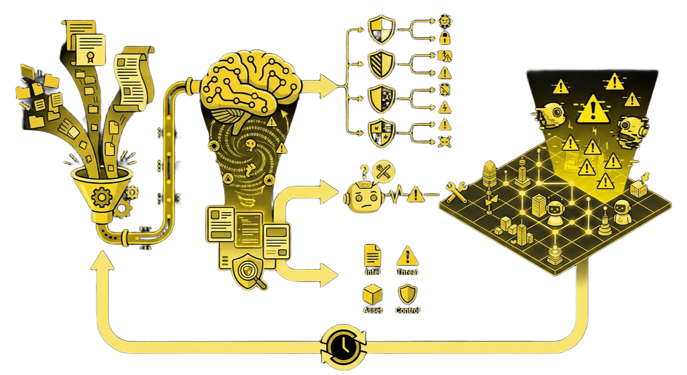

**📹 Platform Demo:**


---

## The Problem

- **Rapidly Evolving Threats**: New MCP vulnerabilities and LLM attack vectors emerge daily.
- **Static Analysis isn't Enough**: Merely checking configuration files misses runtime and ecosystem threats.
- **Data Overload**: Security teams can't manually process thousands of RSS feeds, CVEs, and GitHub issues.
- **Visibility Gap**: It's hard to visualize the attack surface of a complex agentic swarm.

**We built a platform that continuously monitors the MCP threat landscape and visualizes it in 3D.**

---

## The Concept: Why "Hive"?

> "Hive can be interpreted as a beehive. A beehive can be thought of as a place where intelligence gathers."

We designed **MCPThreatHive** with biological inspiration:

- **Organized Intelligence**: Bees exchange messages with no central command, yet the system is highly organized.
- **Value Transformation**: Agents continuously bring back "pollen" (raw data) from the outside world and transform it into something valuable.
- **Living Architecture**: A place where MCP threats come in, connect to each other, and evolve into something defenders can actually **see**.

MCPThreatHive is our contribution to the community->a centralized platform to integrate, classify, and organize the chaos of MCP security.

---

## What This Actually Does

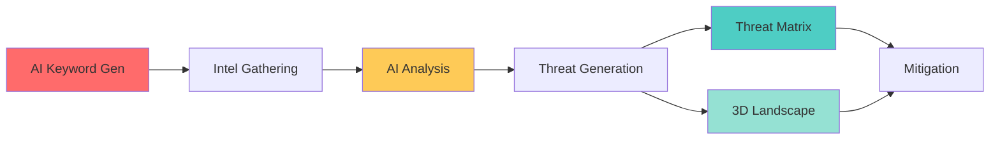

**The Pipeline:**

1. **Gather Intelligence** → Continuously collects data from CVEs, security blogs, and whitepapers focused on MCP and LLM security.
2. **AI Threat Analysis** → Uses LiteLLM to analyze gathered intel and extract actionable threat scenarios.
3. **Generate Threat Models** → Maps intelligence to specific MCP risks (MCP-01 to MCP-38).
4. **3D Visualization** → Projects threats onto an interactive 3D landscape to identify clusters and high-risk zones.
5. **Real-time Synchronization** → The Threat Matrix and 3D Landscape automatically update as new intel arrives.

### 📌 Terminology

- **Intelligence Items**: Raw security data collected from external sources (e.g., a CVE entry, a blog post, or a whitepaper). These are the inputs to the system.
- **Threats**: Specific, structured risk scenarios identified by the AI after analyzing an Intelligence Item. One Intelligence Item can produce multiple Threats (e.g., a single paper might reveal both "Prompt Injection" and "Data Leakage" risks).

**Example Scenario:**
_New intel arrives regarding a "Tool Usage Confusion" attack._

1. **Collector** fetches the article.
2. **Analyzer** identifies it as `MCP-10 (Tool Description Poisoning)`.
3. **Platform** creates a new Threat Card.
4. **3D Map** highlights the "Tool Integration" sector in red.
5. **Matrix** updates the "Spoofing" and "Tool Poisoning" cells.

---

## Real-world Usage

**Who is this for?**

- **Security Researchers**: Analyze new MCP tools for potential abuse vectors without manual code review of every update.
- **Agentic AI Developers**: Visualize the security implications of giving your agent "just one more tool."
- **Red Teamers**: Identify attack paths in agentic systems (e.g., how a prompt injection leads to RCE via a specific CLI tool).

**Common Use Cases:**

1. **Proactive Risk Management & Secure Development**
   _Goal: Enable developers to anticipate risks before implementation, preventing vulnerabilities by design._

   Instead of reactively fixing bugs, agent developers use MCPThreatHive during the design phase to understand the security implications of proposed tools. By querying the platform for specific tool categories (e.g., 'File System'), they receive immediate intelligence on known attack vectors like MCP-08 (Path Traversal). This knowledge allows teams to implement necessary controls—such as sandboxing or input validation—during development, creating a "shift-left" security model for agentic systems.

2. **Intelligence-Driven Scanner Enhancement**
   _Goal: Continuously update organizational defenses with fresh, real-time intelligence._

   For security teams maintaining internal vulnerability scanners, MCPThreatHive acts as a continuous intelligence engine. As the platform aggregates and analyzes new MCP threat patterns from the wild (both fresh and historical), this structured intelligence can be integrated into existing scanning pipelines. This ensures that organizational scanners are constantly updated with the latest detection rules, allowing them to identify emerging threats that static rule sets would miss.

3. **Incident Investigation Enrichment (SOC)**
   _Goal: Accelerate incident response with context-aware vulnerability data._

   Security Operations Center (SOC) analysts can consume vulnerability data from MCPThreatHive to enrich incident investigations. When an alert triggers, analysts can query the platform to determine if a host was exploitable via specific MCP attack vectors (e.g., "Was this host vulnerable to MCP-19 Prompt Injection?"), providing critical context for triage and remediation.

---

### Usage Best Practices

> **⚠️ Performance Warning: Concurrent AI Tasks**
>
> To avoid API rate limits, timeouts, or data inconsistencies, **do not run multiple AI-intensive tasks simultaneously**.
>
> - **Avoid** running "Gather Intel", "Generate Risk Planning", "Generate from Intel", "Generate from Intel", "Regenerate All", at the same time.
> - **Wait** for one task to complete (or for the notification to appear) before starting another.
> - **Why?** Both features make heavy parallel calls to your LLM provider. Running them together may exceed your provider's concurrency limits (RPM/TPM) and cause the application to fail or hang.

---

## Quick Start

```bash

git clone https://github.com/VulcanLab/MCPThreatHive.git
cd MCPThreatHive

# Copy and configure
cp .env.example .env
# Edit .env with your LiteLLM key

# Start everything
docker-compose up -d

#You can restart using this command if you encounter any problems
#docker-compose up -d --build --force-recreate


# Wait ~5 minutes for services...
# Then open http://localhost:5000
```

## Installation

**If you encounter issues using the Docker installation method above, I recommend following the installation steps below instead, as they are less likely to cause problems. If you still run into any issues, feel free to open an issue and let us know**

**Local Setup:**

1. **Start Dependencies (Neo4j):**
   The platform requires Neo4j for the Knowledge Graph and Threat Matrix.

   ```bash
   # Start only the Neo4j database (without the web app container)
   docker-compose up -d neo4j
   ```

2. **Run Application:**

   ```bash
   python3 -m venv venv && source venv/bin/activate
   pip install -r requirements.txt

   # Configuration Manager (Initial Setup & Updates)
   # Use this to configure or update your LLM models and endpoints at any time.
   python scripts/interactive_setup.py

   # Start the API Server
   # (On the very first run, if not configured, this will also trigger the setup wizard)
   python -m api.server
   ```

## Configuration

**Interactive Configuration Manager:**

The platform includes a configuration tool (`scripts/interactive_setup.py`) with a main menu that allows you to:

1. **Run Full Setup Wizard**: Recommended for first-time installation.
2. **Update Model Assignments**: Quickly switch models for different AI roles without re-configuring endpoints.
3. **Manage Endpoints**: Add or edit LiteLLM API keys and URLs (supports multi-endpoint configurations).

To launch the configuration manager:

```bash
python scripts/interactive_setup.py
```

**Minimal `.env`:**

```bash

# LiteLLM API endpoint
LITELLM_API_BASE=https://your-litellm-endpoint.com

# LiteLLM API key (if required by your endpoint)
LITELLM_API_KEY=your-api-key-here

# Default model to use
#If not setup, the AI service won’t work when Docker is started
LITELLM_MODEL=gpt-4o
LITELLM_TEMPERATURE=0.7

# Neo4j connection settings (only needed for Knowledge Graph features)
NEO4J_URI=bolt://localhost:7687
NEO4J_USERNAME=neo4j
NEO4J_PASSWORD=password #Default password

# Flask environment (development/production)
FLASK_ENV=development
FLASK_DEBUG=1

# Server port (default: 5000)
SERVER_PORT=5000

```

### Configuration: Custom LLM Providers

If you are using a custom LLM provider (e.g., vLLM, private endpoint) via LiteLLM, ThreatHive defaults to using the `openai/` prefix for compatibility.

**Example Custom Config (`.env`):**

```bash
LITELLM_PROVIDER=litellm
LITELLM_API_BASE=https://my-private-llm.corp.local/v1
LITELLM_MODEL=custom-model-name
```

**Modifying Provider Logic:**
If your organization requires a different prefix (e.g., `azure/`, `anthropic/`, `huggingface/`), you can modify the provider logic in:

1. **Keyword Generator**: `intel_integration/ai_keyword_generator.py` (Search for `_call_llm`)
2. **Intel Processor**: `intel_integration/ai_processor.py` (Search for `_call_llm`)

Identify the `provider == "litellm"` block and adjust the prefix logic to match your specific model routing requirements.

**What you'll see:**

- **Intelligence Dashboard**: Automated capture of MCP threat intelligence.
  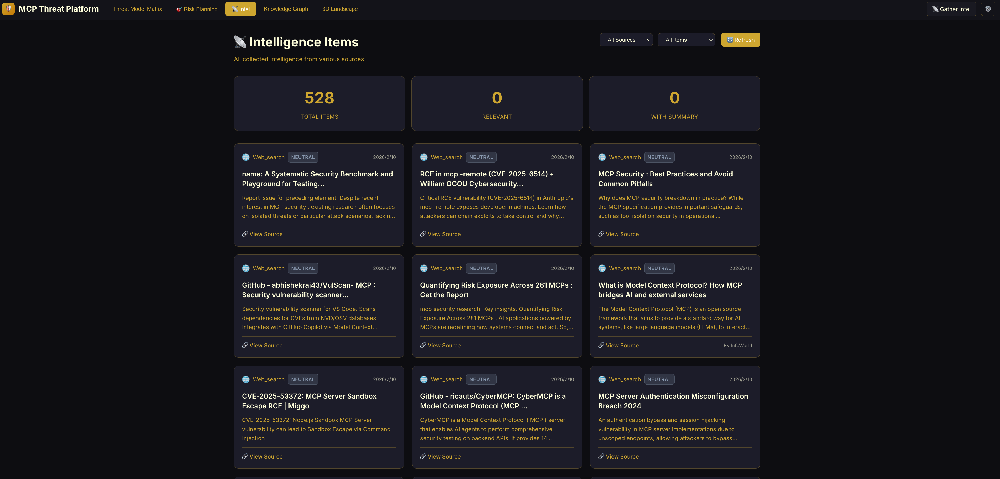
- **Threat Model Matrix & Analysis**: This dashboard visualizes the current threat landscape across three dimensions(Please be sure to press 🔄 Refresh on this page to display all content):
  1. **Threat Matrix**: A risk grid based on the **MCPSecBench Taxonomy** (4 surfaces × 17 attack types) [1]. Red cells indicate high activity or critical risks in that specific area.
  2. **MCP-UPD Attack Chains**: Visualizes "Parasitic Tool Chaining" -> how attackers combine benign tools to create complex exploits (e.g., using a harmless "Calculator" tool to obfuscate a command injection).
  3. **STRIDE Analysis**: Breakdowns of threats by category (Spoofing, Tampering, etc.), helping specialized security teams focus on their specific domain (e.g., Identity vs. Infrastructure).

  |    Threat Matrix (Risk Grid)     | MCP-UPD Attack Chains (Exploits) |
  | :------------------------------: | :------------------------------: |
  | 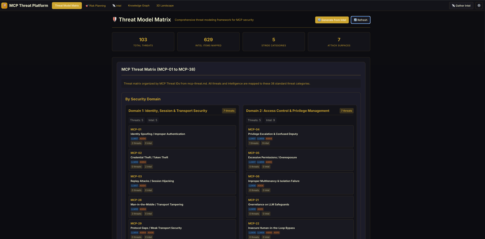 |   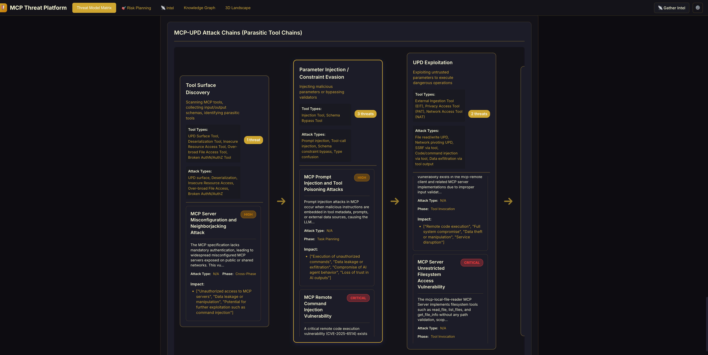   |
  |  **STRIDE: Attack Categories**   |  **STRIDE: Risk Distribution**   |
  |   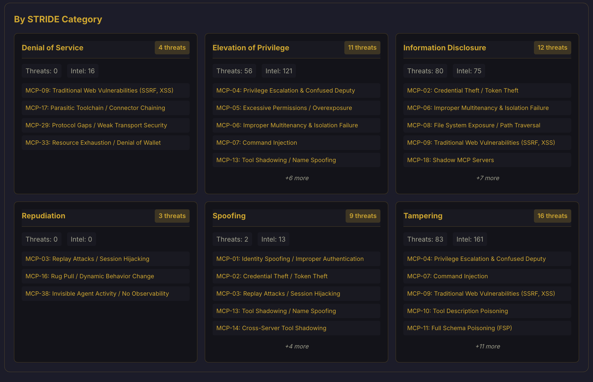    |   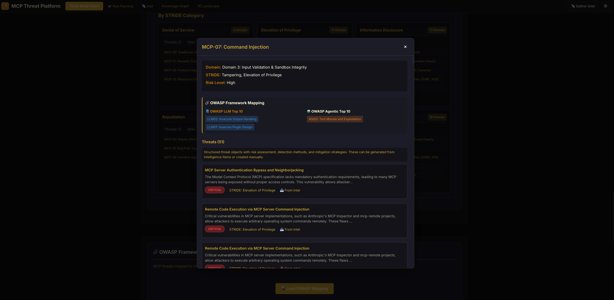   |

- **3D Threat Landscape**: Interactive 3D visualization of the threat environment.
  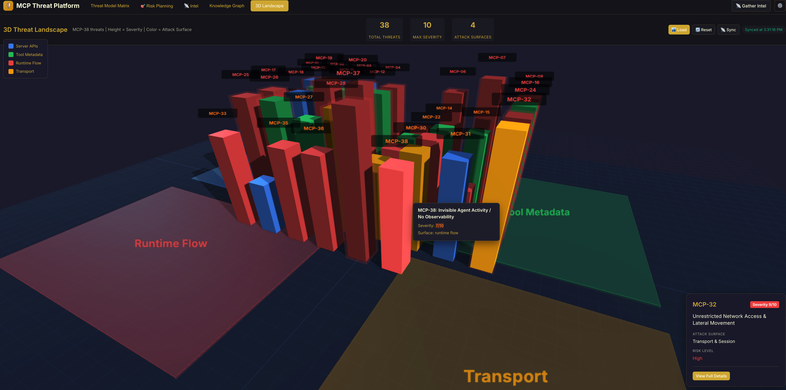
- **Knowledge Graph**: Relationships between intelligence sources, threats, and assets.

  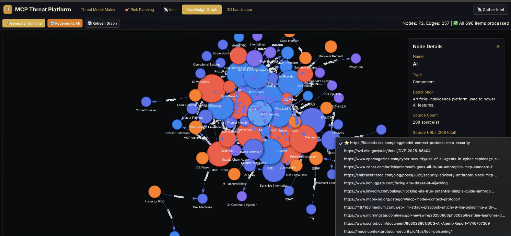
  - 🔗 **Generate from Intel** – If clicking this doesn’t successfully invoke the AI for processing,
  - 🔄 **Regenerate All** – please click here and try again.

- **MCP Risk Planning**: AI-powered risk analysis that automatically generates detection methods, mitigation strategies, and security controls for each identified threat. The system analyzes all collected intelligence and threats to produce actionable security recommendations.
  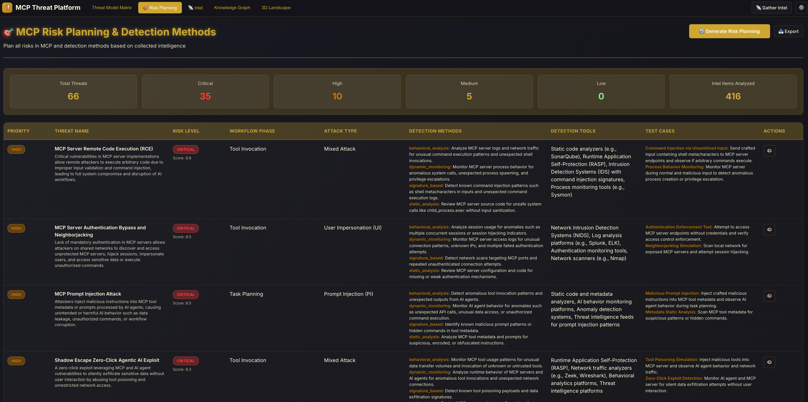

  _Clicking 'Actions' reveals details:_
  

---

## Architecture

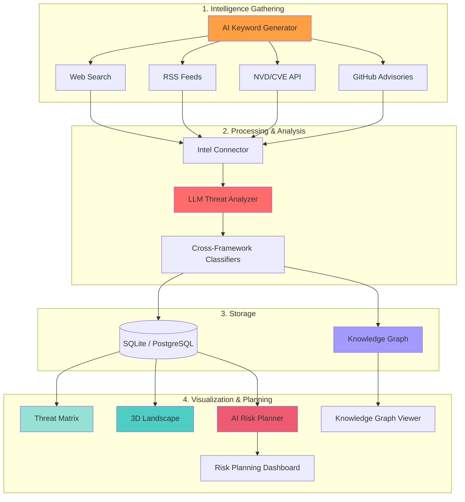

**Key Components:**

| **Component**                   | **Purpose**                                                                                                                                                                                                                          |
| ------------------------------- | ------------------------------------------------------------------------------------------------------------------------------------------------------------------------------------------------------------------------------------ |
| **Intel Collector**             | **Aggregates security data from external sources (Web, RSS, CVE, GitHub).**<br />When the platform starts, please use 📡 Gather Intel to collect intelligence first;**otherwise, no information will be displayed on the platform.** |
| **LLM Threat Analyzer**         | **Uses AI to convert raw intel into structured Threat Cards and extracts attack chains.**                                                                                                                                            |
| **Cross-Framework Classifiers** | **Maps threats simultaneously to OWASP LLM Top 10, OWASP Agentic Applications (Dual Classification), and STRIDE categories.**                                                                                                        |
| **3D Landscape**                | **Visualizes threat clusters and intensity across MCP attack surfaces in an interactive 3D space.**                                                                                                                                  |
| **Threat Matrix**               | **A 4×17 grid heatmap visualizing threats organized by MCPSecBench Attack Surfaces and Attack Types.**                                                                                                                               |
| **Knowledge Graph**             | **Graph database linking Intel -> Threats -> Tools -> Attack Chains (MCP-UPD).**                                                                                                                                                     |
| **Knowledge Graph Viewer**      | **Interactive interface to explore entity relationships and multi-hop attack paths.**                                                                                                                                                |
| **AI Risk Planner**             | **Analyzes threats using a Batch-Aggregate-Refine strategy to generate actionable detection methods and mitigations.**                                                                                                               |
| **Risk Planning Dashboard**     | **Dashboard displaying the AI-generated risk analysis, detection methods, and mitigation recommendations.**                                                                                                                          |

## Threat Frameworks

MCPThreatHive uses a **multi-framework approach** to ensure comprehensive threat coverage. Every threat is analyzed through multiple security lenses simultaneously, providing defense teams with actionable insights across different security domains.

### Framework Integration Overview

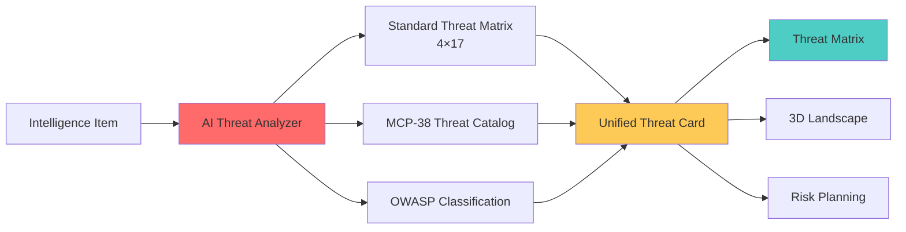

**Why Multiple Frameworks?**

- **Threat Matrix** **: Provides systematic attack surface coverage (where the attack happens).**
- **MCP 1-38 Catalog** **: Offers specific MCP threat patterns (what the attack does).**
- **OWASP Mapping** **: Maps to industry-standard security frameworks (how to communicate with different security teams).**

---

### 1. MCPSecBench-based Threat Matrix

**The Threat Matrix** is a systematic security framework specifically designed for Model Context Protocol ecosystems. It visualises the threat landscape using a **4 × 17 matrix grid (yielding 68 potential threat intersections)**, crossing the four formal attack surfaces with the 17 distinct attack types defined by MCPSecBench.

#### Attack Surfaces & Frontend Mapping

The 3D Threat Landscape in the frontend visualizes these risks across 4 distinct zones. Here is how they map directly to the formal **MCPSecBench** taxonomy:

| Frontend Zone (3D View) | MCPSecBench Surface  | Focus Area                                                                               |
| :---------------------- | :------------------- | :--------------------------------------------------------------------------------------- |
| **Runtime Flow**        | **Client Surface**   | Attacks targeting how the LLM parses prompts and selects tools (e.g., Prompt Injection). |
| **Tool Metadata**       | **Host Surface**     | Flaws in host application implementation, configuration, or schema handling.             |
| **Transport**           | **Protocol Surface** | Attacks at the network/transport layer (e.g., MitM, Rebinding).                          |
| **Server APIs**         | **Server Surface**   | Threats aimed at tool logic, server configuration, and execution environments.           |

---

### MCPSecBench – Taxonomy of 17 Attack Types

The platform implements the **17 attack types** defined by the MCPSecBench paper ([arXiv:2508.13220](https://arxiv.org/abs/2508.13220)), systematically categorized across the framework's four formal attack surfaces:

#### **1) Client Surface (LLM / Agent Interface)**

_Attacks targeting how the LLM parses prompts and selects tools._

1. **Prompt Injection (ATT-1)** – Malicious inputs that subvert intended agent workflows.
2. **Tool/Service Misuse via “Confused AI” (ATT-2)** – Malware triggers due to deceptive natural language tool descriptions misleading the LLM.

#### **2) Host Surface (Application / Platform Integration)**

_Attacks exploiting implementation flaws or misconfigurations on the host environment._ 3. **Schema Inconsistencies (ATT-3)** – Outdated or broken client schemas preventing secure operations or causing DoS. 4. **Slash Command Overlap (ATT-4)** – Conflicting command names lead to unintended tool invocation by the user. 5. **Vulnerable Client (ATT-14)** – Exploiting implementation flaws (e.g., CVE-2025-6514 in `mcp-remote`) to achieve RCE on the host. 6. **Configuration Drift (ATT-15)** – Insecure host-level configurations (e.g., exposing local servers to 0.0.0.0) exposing internal systems.

#### **3) Protocol Surface (Transport Layer)**

_Attacks exploiting the unencrypted/unauthenticated nature of local or remote connections._ 7. **MCP Rebinding (ATT-5)** – DNS or connection manipulation redirects client connections to malicious endpoints. 8. **Man-in-the-Middle / MitM (ATT-6)** – Interception or modification of protocol messages due to insecure transport.

#### **4) Server Surface (Tools & Resources)**

_Attacks originating from malicious, spoofed, or vulnerable MCP servers._ 9. **Tool Shadowing Attack (ATT-7)** – Injecting deceptive tool descriptions so the agent invokes unintended tools sequentially. 10. **Data Exfiltration (ATT-8)** – Tricking the protocol into leaking sensitive data (conversations, tool lists, API keys). 11. **Package Name Squatting - Tool Name (ATT-9)** – Malicious tools with misleading names confuse the LLM's selection logic. 12. **Indirect Prompt Injection (ATT-10)** – Malicious content embedded in external resources altering agent behavior when read. 13. **Package Name Squatting - Server Name (ATT-11)** – Spoofed server identities mislead routing decisions and validation trust. 14. **Tool Poisoning (ATT-12)** – Malicious tools highly prioritized via hyper-relevant but deceptive manifests. 15. **Rug Pull Attack (ATT-13)** – Servers behaving benignly at first, then dynamically switching to malicious behavior. 16. **Sandbox Escape (ATT-16)** – Breaking out from restricted execution environments via server-side exploits. 17. **Vulnerable Server (ATT-17)** – Exploiting server bugs (e.g., path traversal, SQLi) to bypass authorization.

_(This taxonomy is established by MCPSecBench for comprehensive MCP security evaluation)_

#### Application in Platform

These 17 attack types are rigorously applied across the platform's architecture:

1. **AI Threat Classification**: The `IntelPipeline` and `RiskPlanner` use the `MCPSecBenchAttackType` enum (ATT-1 through ATT-17) to classify every incoming threat intelligence item.
2. **Standardized Data Schema**: The database schema (`schemas/mcpsecbench_schema.py`) enforces these 17 types as the source of truth for all threat records, ensuring consistency between the UI and the underlying data.

### 2. MCP 1-38 Threat Catalog

The **MCP 1-38 Threat Catalog** is our curated collection of **38 specific MCP threat patterns** (MCP-01 to MCP-38). Instead of relying on generic software security domains, MCPThreatHive organizes these threats into **five protocol-specific risk categories** defined by the structural properties of MCP they exploit. Each threat has a unique ID, detailed description, and mapped mitigations.

| Category                                     | Threat IDs                                         | Core Property Exploited / Focus Area                                         | Example Threats                                                                                |
| :------------------------------------------- | :------------------------------------------------- | :--------------------------------------------------------------------------- | :--------------------------------------------------------------------------------------------- |
| **I. Semantic Manipulation & Poisoning**     | MCP-10 to MCP-15                                   | LLM tool selection is vocabulary-driven.                                     | Tool Description Poisoning, Full Schema Poisoning, Preference Manipulation (PMPA)              |
| **II. Prompt Injection & Boundary Breaking** | MCP-07, MCP-08, MCP-17, MCP-19, MCP-20, MCP-37     | Instruction–data boundary is not enforced at the protocol layer.             | Prompt Injection (Direct/Indirect), Parasitic Toolchain, Command Injection, Sandbox Escape     |
| **III. Identity, Trust & Supply Chain**      | MCP-01 to MCP-03, MCP-16, MCP-18, MCP-26 to MCP-31 | MCP has no mandatory cryptographic server identity or content integrity.     | Rug Pull / Dynamic Behavior Change, Supply Chain Compromise, Shadow MCP Servers                |
| **IV. Access Control & Logic Drift**         | MCP-04 to MCP-06, MCP-21 to MCP-23, MCP-35, MCP-36 | Agents exercise autonomous decision-making without deterministic guardrails. | Privilege Escalation, Agent Logic Drift, Multi-Agent Context Hijacking, Isolation Failure      |
| **V. Data Exfiltration & Resource Abuse**    | MCP-24, MCP-25, MCP-32 to MCP-34, MCP-38           | Agents can aggregate, correlate, and act on data across disparate tools.     | Privacy Inversion, Data Exfiltration via Tool Output, Denial of Wallet (DoW), No Observability |

### Complete MCP-38 Threat

| ID         | Threat Name                                    | Risk Level | Key Risk Rationale                                                                                                                                                        |
| ---------- | ---------------------------------------------- | ---------- | ------------------------------------------------------------------------------------------------------------------------------------------------------------------------- |
| **MCP-01** | Identity Spoofing / Improper Authentication    | High       | Identity forgery leads to unauthorized access and audit trail failures                                                                                                    |
| **MCP-02** | Credential Theft / Token Theft                 | High       | Stolen credentials enable complete impersonation of legitimate agents                                                                                                     |
| **MCP-03** | Replay Attacks / Session Hijacking             | High       | Replay enables repeated execution of sensitive operations (e.g., transfers, leaks)                                                                                        |
| **MCP-04** | Privilege Escalation & Confused Deputy         | High       | Privilege escalation grants direct access to higher-level permissions                                                                                                     |
| **MCP-05** | Excessive Permissions / Overexposure           | Medium     | Over-permissioning has high impact but requires agent control first                                                                                                       |
| **MCP-06** | Improper Multitenancy & Isolation Failure      | High       | Cross-tenant leakage or escalation affects entire multi-tenant systems                                                                                                    |
| **MCP-07** | Command Injection                              | High       | Direct RCE with full server compromise                                                                                                                                    |
| **MCP-08** | File System Exposure / Path Traversal          | High       | Arbitrary file read/write leads to data leakage or backdoor installation                                                                                                  |
| **MCP-09** | Traditional Web Vulnerabilities (SSRF, XSS)    | Medium     | SSRF/XSS enables internal network probing or session hijacking via HTTP exposure                                                                                          |
| **MCP-10** | Tool Description Poisoning                     | High       | Misleads LLM into executing arbitrary tool calls                                                                                                                          |
| **MCP-11** | Full Schema Poisoning (FSP)                    | High       | Schema poisoning affects all invocations and is difficult to detect                                                                                                       |
| **MCP-12** | Resource Content Poisoning                     | High       | Persistent indirect injection affects long-term behavior                                                                                                                  |
| **MCP-13** | Tool Shadowing / Name Spoofing                 | Medium     | Misleads LLM to select wrong tools; limited impact but aids other attacks                                                                                                 |
| **MCP-14** | Cross-Server Tool Shadowing                    | Medium     | Cross-server tool call hijacking has higher impact but requires specific setup                                                                                            |
| **MCP-15** | Preference Manipulation Attack (PMPA)          | Medium     | Biases LLM tool selection; affects decisions but rarely causes direct harm                                                                                                |
| **MCP-16** | Rug Pull / Dynamic Behavior Change             | High       | Post-trust malicious transformation has severe impact                                                                                                                     |
| **MCP-17** | Parasitic Toolchain / Connector Chaining       | High       | Tool chain abuse bypasses controls or exfiltrates data                                                                                                                    |
| **MCP-18** | Shadow MCP Servers                             | High       | Hidden servers enable long-term unmonitored malicious operations                                                                                                          |
| **MCP-19** | Prompt Injection (Direct)                      | Critical   | Direct system prompt override leads to arbitrary behavior                                                                                                                 |
| **MCP-20** | Prompt Injection (Indirect via Data)           | Critical   | Indirect injection is hard to prevent and has persistent impact                                                                                                           |
| **MCP-21** | Overreliance on LLM Safeguards                 | Medium     | Over-dependence on LLM protections is easily bypassed                                                                                                                     |
| **MCP-22** | Insecure Human-in-the-Loop Bypass              | Medium     | Bypasses human approval but requires user interaction                                                                                                                     |
| **MCP-23** | Consent / Approval Fatigue                     | Low        | User fatigue leads to mistaken approvals; indirect impact                                                                                                                 |
| **MCP-24** | Data Exfiltration via Tool Output              | High       | Tool output directly leaks sensitive data                                                                                                                                 |
| **MCP-25** | Privacy Inversion / Data Aggregation Leakage   | High       | Aggregation leakage enables privacy inversion attacks                                                                                                                     |
| **MCP-26** | Supply Chain Compromise                        | High       | Supply chain compromise plants backdoors affecting entire ecosystem                                                                                                       |
| **MCP-27** | Missing Integrity Verification                 | High       | Lack of integrity checks enables tampering                                                                                                                                |
| **MCP-28** | Man-in-the-Middle / Transport Tampering        | High       | MITM intercepts/tampers all traffic                                                                                                                                       |
| **MCP-29** | Protocol Gaps / Weak Transport Security        | Medium     | Weak protocols are exploitable but require transport layer exposure                                                                                                       |
| **MCP-30** | Insecure stdio Descriptor Handling             | Medium     | MCP standardizes stdio as a transport, where a co-located malicious process can exploit shared file descriptors to inject commands or steal data from the message stream. |
| **MCP-31** | MCP Endpoint / DNS Rebinding                   | Medium     | DNS rebinding tricks local clients into connecting to malicious endpoints                                                                                                 |
| **MCP-32** | Unrestricted Network Access & Lateral Movement | High       | Lateral movement enables attacks on other internal systems                                                                                                                |
| **MCP-33** | Resource Exhaustion / Denial of Wallet         | Medium     | Resource exhaustion causes DoS or financial loss                                                                                                                          |
| **MCP-34** | Tool Manifest Reconnaissance                   | Low        | Reconnaissance of tool manifests has limited impact                                                                                                                       |
| **MCP-35** | Planning / Agent Logic Drift                   | Medium     | Logic drift affects long-term behavior but requires multi-round manipulation                                                                                              |
| **MCP-36** | Multi-Agent Context Hijacking                  | Medium     | Context hijacking affects multi-agent collaboration                                                                                                                       |
| **MCP-37** | Sandbox Escape                                 | High       | Sandbox escape grants direct host system access                                                                                                                           |
| **MCP-38** | Invisible Agent Activity / No Observability    | Medium     | Lack of observability makes malicious activity hard to track                                                                                                              |

**Note on Risk Levels: Risk levels (Critical, High, Medium, Low) are derived from a quantitative risk scoring model adapted from DREAD. Scores range from 0 to 10, with thresholds aligned to CVSS severity bands: Critical ≥ 9.0, High 7.0–8.9, Medium 4.0–6.9, Low < 4.0**

**How to Use MCP IDs:**

- **Threat Cards**: Each generated threat is tagged with relevant MCP IDs (e.g., `MCP-11`, `MCP-19`).
- **Risk Planning**: Detection methods reference specific MCP IDs for targeted monitoring.
- **Knowledge Graph**: Threats are linked by shared MCP IDs and categories for pattern discovery.
- **3D Landscape**: Threats cluster by **MCPSecBench attack surfaces**, revealing high-density vulnerability areas.

---

### 3. OWASP Classification

Every threat in MCPThreatHive is **simultaneously classified across two OWASP frameworks**, enabling cross-domain security analysis and communication with different security teams.

| Framework                                                     | Coverage    | Purpose                                                          |
| ------------------------------------------------------------- | ----------- | ---------------------------------------------------------------- |
| **OWASP Top 10 for Large Language Model Applications (2025)** | LLM01-LLM10 | Identifies LLM-specific attack vectors for AI security teams     |
| **OWASP Top 10 for Agentic Applications (2026)**              | ASI01-ASI10 | Covers agentic system risks for autonomous agentic AI developers |

#### ⚠️ Limitations & Disclaimer

**AI Classification Accuracy:**
This platform uses Large Language Models to analyze and classify threat intelligence. While we optimize prompts for accuracy, **AI models can hallucinate or misclassify technical details**.

- **False Positives**: Innocent tool descriptions might be flagged as malicious.
- **Misclassification**: A "Prompt Injection" might be mislabeled as "Jailbreak".
- **Human Review Required**: Always verify critical findings manually before taking blocking actions.

We are continuously improving our classification pipeline. Please treat the "Threat Level" and "Category" as **strong indicators, not absolute truths**.

## License

Apache License 2.0 - see [LICENSE](LICENSE)

## References & Acknowledgements

- **Model Context Protocol**: Official documentation at [modelcontextprotocol.io](https://modelcontextprotocol.io).
- **MCPSecBench**: The threat matrix structure (4 surfaces × 17 attack types) and taxonomy are directly adapted from this framework to ensure consistent AI tagging and misalignment detection.
  - Paper: [https://arxiv.org/abs/2508.13220](https://arxiv.org/abs/2508.13220) (Used for: Threat Matrix Taxonomy, Attack Type Classification)
- **OWASP**: Threat classifications align with OWASP Top 10 for LLM Applications (LLM01-LLM10) and OWASP Top 10 for Agentic AI (ASI01-ASI10) to provide industry-standard risk mapping.
- **MCP Security Bench (MSB): Benchmarking Attacks Against Model Context Protocol in LLM Agents**
  - Paper: https://arxiv.org/abs/2510.15994 (Used for: Empirical attack success rate (ASR) data for semantic attack types, providing the primary empirical foundation for risk scoring calibration)
- **MPMA: Preference Manipulation Attack Against Model Context Protocol**
  - Paper: https://arxiv.org/abs/2505.11154 (Used for: Identifying MCP-15 Preference Manipulation scenarios in the AI Threat Analyzer)
- **Mind Your Server: A Systematic Study of Parasitic Toolchain Attacks on the MCP Ecosystem**
  - Paper: https://arxiv.org/pdf/2509.06572 (Used for: Detecting "Parasitic Tool Chain" (MCP-17) and "Tool-to-Tool" parasitic behaviors in the Knowledge Graph)

## Technical Documentation

For a detailed explanation of the algorithms, AI techniques, and risk assessment methodologies used in this platform, please refer to the [Technical Architecture Report](docs/algorithm_technical_report.md).
